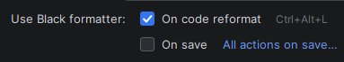

# Discord.py Bot Template

A modern, production-ready Discord bot boilerplate built with Python 3.11+ and discord.py 2.6.4. Use this as your
starting point to build scalable, maintainable Discord bots with clean architecture and modern best practices.

## Features

✨ **Core Features**

- 🤖 Built with discord.py 2.6.4
- 🐍 Python 3.11+ support (tested up to 3.14)
- ⚙️ Type-safe configuration management with Pydantic
- 🎨 Beautiful colored console logging with file rotation
- 📊 SQLAlchemy 2.0 with async support (SQLite & PostgreSQL)
- 🔄 Automatic cog/extension loading system
- 🛡️ Comprehensive error handling and logging
- 📝 Command usage tracking
- 🎭 Customizable bot presence and status
- 🔧 Guild-specific configuration support

🚀 **Developer Experience**

- 📦 Easy setup with Docker and docker-compose
- 🔒 Environment-based configuration with .env
- 📋 Type hints throughout the codebase
- 🎯 **Slash commands only** (modern Discord UI)
- 🔌 Hot-reloadable extensions
- 📊 Database health monitoring
- 📚 Template cogs for slash commands and events
- 🚫 Ignore specific cogs (IGNORED_COGS)
- 📌 Simple versioning in `bot/__init__.py`

## Project Structure

```
DiscordPyBotTemplate/
├── bot/
│   ├── cogs/
│   │   ├── __init__.py
│   │   ├── admin.py            # Admin slash commands (owner only)
│   │   ├── general.py          # General slash commands
│   │   ├── template_events.py  # Template for event listeners
│   │   └── template_slash.py   # Template for slash commands
│   ├── core/
│   │   ├── __init__.py
│   │   ├── bot.py              # Main bot class
│   │   └── config.py           # Configuration with Pydantic
│   ├── database/
│   │   ├── __init__.py
│   │   ├── manager.py          # Database operations
│   │   └── models.py           # SQLAlchemy models
│   ├── utils/
│   │   ├── __init__.py
│   │   └── logger.py           # Colored logging setup
│   └── __init__.py             # Package init + version management
├── data/                       # SQLite database (auto-created)
├── logs/                       # Log files (auto-created)
├── scripts/                    # Scripts to run for easy setup/management (`python scripts/script.py`)
├── .env.example                # Example configuration
├── .gitignore
├── docker-compose.yml
├── Dockerfile
├── LICENSE
├── main.py                     # Entry point
├── pyproject.toml              # Tool configuration (black, ruff, mypy)
├── README.md
└── requirements.txt
```

## Getting Started

### Prerequisites

- Python 3.11 or higher
- A Discord bot token ([Create one here](https://discord.com/developers/applications))
- (Optional) PostgreSQL database
- (Optional) Docker and Docker Compose

### Installation

#### Option 1: Use as Template (Recommended)

1. **Click "Use this template" on GitHub** or clone the repository
   ```bash
   git clone https://github.com/jvherck/DiscordPyBotTemplate.git my-discord-bot
   cd my-discord-bot
   ```

2. **Create a virtual environment**
   ```bash
   python -m venv .venv

   # On Windows
   .venv\Scripts\activate

   # On Unix/MacOS
   source .venv/bin/activate
   ```

3. **Install dependencies**
   ```bash
   pip install -r requirements.txt
   ```

4. **Configure environment variables**
   ```bash
   # Copy the example env file
   cp .env.example .env

   # Edit .env and add your Discord bot token
   # Minimum required: DISCORD_TOKEN
   ```

5. **Run the bot**
   ```bash
   python main.py
   ```

#### Option 2: Docker Setup

1. **Clone the repository**
   ```bash
   git clone <your-repo-url>
   cd DiscordPyBotTemplate
   ```

2. **Configure environment variables**
   ```bash
   cp .env.example .env
   # Edit .env and add your configuration
   ```

3. **Build and run with Docker Compose**
   ```bash
   # Start with SQLite (default)
   docker compose up -d bot

   # Or start with PostgreSQL
   docker compose up -d
   ```

4. **View logs**
   ```bash
   docker compose logs -f bot
   ```

5. **Stop the bot**
   ```bash
   docker compose down
   ```

## Configuration

### Environment Variables

Configure your bot by editing the `.env` file. Here are the most important settings:

#### Required Settings

```env
DISCORD_TOKEN=your_bot_token_here
```

#### Bot Settings

```env
DISCORD_PREFIX=!                    # Command prefix (used for admin fallback commands)
BOT_NAME=MyDiscordBot              # Bot name for logging
ENVIRONMENT=development            # development, staging, production
IGNORED_COGS=template_slash,template_events  # Comma-separated cogs to ignore on startup
```

> **Note:** Version is managed in `bot/__init__.py` - no need to set it in `.env`

#### Database Settings

```env
# SQLite (default)
DATABASE_TYPE=sqlite
DATABASE_URL=sqlite:///data/bot.db

# PostgreSQL (uncomment to use)
# DATABASE_TYPE=postgresql
# POSTGRES_USER=botuser
# POSTGRES_PASSWORD=secure_password
# POSTGRES_DB=discord_bot
# POSTGRES_HOST=postgres
# POSTGRES_PORT=5432
```

#### Logging Settings

```env
LOG_LEVEL=INFO                     # DEBUG, INFO, WARNING, ERROR, CRITICAL
LOG_TO_FILE=true
LOG_FILE_PATH=logs/bot.log
LOG_MAX_BYTES=10485760             # 10MB
LOG_BACKUP_COUNT=5
```

#### Feature Flags

```env
ENABLE_COMMAND_LOGGING=true        # Log command usage to database
ENABLE_ERROR_REPORTING=true        # Log errors to database
ENABLE_PRESENCE_UPDATE=true        # Update bot presence/status
```

#### Bot Presence

```env
PRESENCE_TYPE=playing              # playing, watching, listening, streaming
PRESENCE_TEXT=with commands | !help
PRESENCE_STATUS=online             # online, idle, dnd, invisible
```

See `.env.example` for all available configuration options.

### `pyproject.toml` tool configuration

This file serves as the centralized configuration for code quality tools. It ensures that everyone using this template
has a consistent coding environment without needing to manually configure their editors.

**Note:** This file is used **strictly for tool configuration**. Project dependencies (libraries like `discord.py`) are
managed separately in `requirements.txt`.

The following tools are pre-configured:

- **Black (Formatter):**
    - Configured with a **line length of 120** (instead of the default 88) to accommodate modern screens and slightly
      longer
    - discord.py lines.
    - Targets Python 3.11+ syntax.

> **JetBrains Integration:** If you use PyCharm, you can configure the IDE to use the Black binary (and this
> configuration file) automatically when you run the standard "Reformat Code" action.
> 1. Go to **Settings/Preferences** > **Tools** > **Black**.
> 2. Check the box **"On code reformat"**.
> 3. Now, pressing `Ctrl+Alt+L` (or your specific reformat shortcut) will format the file using Black settings
     defined here.
>
> 

- **Ruff (Linter):**
    - A high-performance replacement for Flake8 and Isort.
    - Sorts imports automatically and catches common bugs or style issues.
    - Configured to ignore minor stylistic nitpicks so you can focus on logic.


- **Mypy (Type Checker):**
    - **Beginner-Friendly Mode:** Strictness settings are set to `false`. Mypy will help you catch logical errors (like
      adding a string to a number) but will **not** force you to write type hints for every single function.
    - Includes `ignore_missing_imports` to prevent false positives from libraries that don't fully support typing.

> Check the Development: Code Formatting section to see examples of how to use these tools.

---

Would you like me to create a "Troubleshooting" section for when Black doesn't detect the `pyproject.toml` file
correctly in the IDE?

## Usage

This is a **boilerplate** - you're meant to clone/fork it and build your bot directly on top of it. This is your
starting codebase, not a library to install.

### Building Your Bot

1. **Modify the bot configuration** in `.env` to match your needs
2. **Add your own cogs** to the `bot/cogs/` directory
3. **Customize the bot behavior** by editing `bot/core/bot.py`
4. **Add your own database models** in `bot/database/models.py`
5. **Update bot metadata** in `bot/__init__.py` (version, author)

### Extending the Bot Class

You can subclass `DiscordBot` in `main.py` for custom initialization:

```python
from bot import DiscordBot, BotConfig


class MyBot(DiscordBot):
    """Your custom bot."""

    async def on_ready(self):
        await super().on_ready()
        self.logger.info("My custom bot is ready!")
        # Add your custom startup logic here


if __name__ == "__main__":
    bot = MyBot()
    bot.run()
```

### Startup Methods

The `DiscordBot` class provides three methods to start your bot, catering to different use cases:

1. **`run()` (Recommended)**
    - **Description:** The standard, most robust way to start the bot. It handles the event loop, signal handling (
      Ctrl+C), and cleanup automatically.
    - **Usage:** `bot.run()`
    - **When to use:** For almost all standard use cases where the bot is the main application.

2. **`run_with_asyncio()`**
    - **Description:** Creates a new asyncio event loop and runs the bot inside it. Useful if you need a fresh loop but
      want specific control or the error handling wrapper provided by this template.
    - **Usage:** `bot.run_with_asyncio()`
    - **When to use:** If you need to run the bot synchronously but require a specific asyncio setup different from the
      standard `run()` method.

3. **`start()`**
    - **Description:** An `async` method that starts the bot connection. It **does not** handle the event loop; you must
      await it inside an existing loop.
    - **Usage:** `await bot.start()`
    - **When to use:** If you are integrating the bot into a larger async application (e.g., running alongside a web
      server like FastAPI or Aiohttp) and already have an event loop running.

### Creating Cogs

Create new cogs in the `bot/cogs/` directory. They will be automatically loaded on startup.

#### Template Cogs

The template includes two example cogs (ignored by default in `.env`):

1. **`template_slash.py`** - Shows how to create slash commands
    - Simple slash commands
    - Commands with parameters and choices
    - Command groups (subcommands)
    - Embed creation

2. **`template_events.py`** - Shows how to handle Discord events
    - Message events (`on_message`, `on_message_edit`, `on_message_delete`)
    - Member events (`on_member_join`, `on_member_remove`)
    - Reaction events (`on_reaction_add`, `on_raw_reaction_add`)
    - Voice state events (`on_voice_state_update`)

To use these templates:

1. Copy the template file and rename it
2. Modify the code to fit your needs
3. Remove it from `IGNORED_COGS` in `.env` (or remove the `IGNORED_COGS` line entirely)

#### Slash Command Example

```python
import discord
from discord import app_commands
from discord.ext import commands
from bot.core.bot import DiscordBot


class MyCog(commands.Cog):
    """My custom cog."""

    def __init__(self, bot: DiscordBot):
        self.bot = bot

    @app_commands.command(name="mycommand", description="My custom command")
    @app_commands.describe(text="Some text parameter")
    async def my_command(self, interaction: discord.Interaction, text: str):
        """My custom slash command."""
        await interaction.response.send_message(f"You said: {text}")


async def setup(bot: DiscordBot):
    """Required setup function."""
    await bot.add_cog(MyCog(bot))
```

#### Event Listener Example

```python
import discord
from discord.ext import commands
from bot.core.bot import DiscordBot


class MyEventCog(commands.Cog):
    """Handle Discord events."""

    def __init__(self, bot: DiscordBot):
        self.bot = bot

    @commands.Cog.listener()
    async def on_message(self, message: discord.Message):
        """Listen for messages."""
        if message.author.bot:
            return
        # Handle message event
        pass


async def setup(bot: DiscordBot):
    """Required setup function."""
    await bot.add_cog(MyEventCog(bot))
```

#### Ignoring Cogs

To temporarily disable a cog without deleting it, add it to `IGNORED_COGS` in your `.env` file:

```env
IGNORED_COGS=template_slash,template_events,work_in_progress_cog
```

This is useful for:

- Keeping template cogs in your project for reference
- Disabling work-in-progress features
- Testing without certain cogs loaded

### Database Usage

The bot includes a powerful database manager that works with both SQLite and PostgreSQL.

#### Using Existing Models

```python
from bot.database.models import GuildConfig, UserData

# Get guild configuration
guild_config = await bot.db.get(GuildConfig, guild_id, "guild_id")

# Create user data
user = UserData(
    user_id=123456789,
    username="TestUser",
    experience=100,
    level=5
)
await bot.db.create(user)

# Update user data
user.experience += 50
await bot.db.update(user)
```

#### Creating Custom Models

```python
from datetime import datetime
from sqlalchemy import BigInteger, String
from sqlalchemy.orm import Mapped, mapped_column
from bot.database.models import Base


class MyModel(Base):
    """Custom database model."""

    __tablename__ = "my_table"

    id: Mapped[int] = mapped_column(primary_key=True, autoincrement=True)
    user_id: Mapped[int] = mapped_column(BigInteger)
    data: Mapped[str] = mapped_column(String(255))
    created_at: Mapped[datetime] = mapped_column(default=datetime.utcnow)
```

### Built-in Commands

#### Admin Commands (Owner Only)

Most admin commands are slash commands, but some have prefix-based fallbacks (using `!`) for troubleshooting:

- `/sync` (or `!sync`) - Sync slash commands (with options for global, current guild, copy, or clear)
- `/reload <extension>` - Reload a cog
- `/load <extension>` - Load a cog
- `/unload <extension>` - Unload a cog
- `/cogs` - List all loaded cogs
- `/shutdown` - Shut down the bot
- `/dbhealth` (or `!dbhealth`) - Check database health

#### General Commands (All Users)

Built-in slash commands available to all users:

- `/ping` - Check bot latency
- `/info` - Display bot information
- `/serverinfo` - Display server information (guild only)

## Development

### Code Formatting

```bash
# Format with black
black bot/

# Lint with ruff
ruff check bot/

# Type checking with mypy
mypy bot/
```

### Hot Reloading

While the bot is running, you can reload cogs without restarting using the `/reload` slash command in Discord:

```
/reload general  # Reloads the general cog
```

## Docker Deployment

### Building the Image

```bash
docker build -t discord-bot:latest .
```

### Using Docker Compose

```bash
# Start all services
docker compose up -d

# View logs
docker compose logs -f bot

# Restart bot
docker compose restart bot

# Stop all services
docker compose down

# Rebuild and restart
docker compose up -d --build
```

### Production Tips

1. Use PostgreSQL instead of SQLite for better performance
2. Set `ENVIRONMENT=production` in your `.env` file
3. Use strong passwords for database credentials
4. Enable log rotation to prevent disk space issues
5. Use Docker secrets for sensitive data
6. Back up your database regularly

## Troubleshooting

### Common Issues

**Bot not starting:**

- Check that `DISCORD_TOKEN` is set correctly in `.env`
- Verify Python version is 3.11 or higher
- Check logs in the `logs/` directory

**Database errors:**

- Ensure the `data/` directory exists and is writable
- For PostgreSQL, verify connection details and that the database is running
- Check database health with `!dbhealth` command

**Commands not responding:**

- Verify bot has `MESSAGE_CONTENT` intent enabled in Discord Developer Portal
- Check bot has necessary permissions in the server
- Review command prefix in configuration

**Slash commands not appearing:**

- Run `!sync` to sync commands globally (takes up to 1 hour)
- Use `!sync ~` for instant sync in current guild (for testing)
- Verify bot has `applications.commands` scope

### Debug Mode

Enable debug mode for verbose logging:

```env
DEBUG_MODE=true
LOG_LEVEL=DEBUG
```

## Contributing

Feel free to submit issues and pull requests to improve this template!

1. Fork the repository
2. Create a feature branch (`git checkout -b feature/amazing-feature`)
3. Commit your changes (`git commit -m 'Add amazing feature'`)
4. Push to the branch (`git push origin feature/amazing-feature`)
5. Open a Pull Request

## License

This project is licensed under the MIT License - see the LICENSE file for details.

## Support

- **Documentation:** [discord.py docs](https://discordpy.readthedocs.io/)
- **Discord.py Server:** [discord.gg/dpy](https://discord.gg/dpy)
- **Issues:** [GitHub Issues](https://github.com/jvherck/DiscordPyBotTemplate/issues)

## Credits

Created by [Jan Van Herck](https://github.com/jvherck)

Built with:

- [discord.py](https://github.com/Rapptz/discord.py) - Discord API wrapper
- [SQLAlchemy](https://www.sqlalchemy.org/) - Database ORM
- [Pydantic](https://docs.pydantic.dev/) - Configuration management
- [colorlog](https://github.com/borntyping/python-colorlog) - Colored logging
